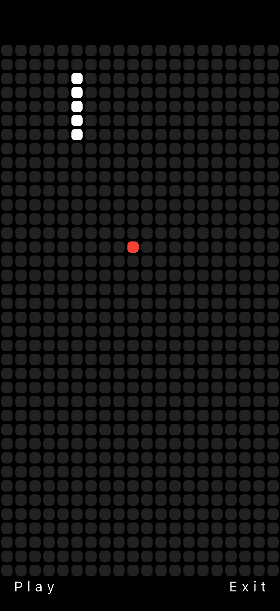
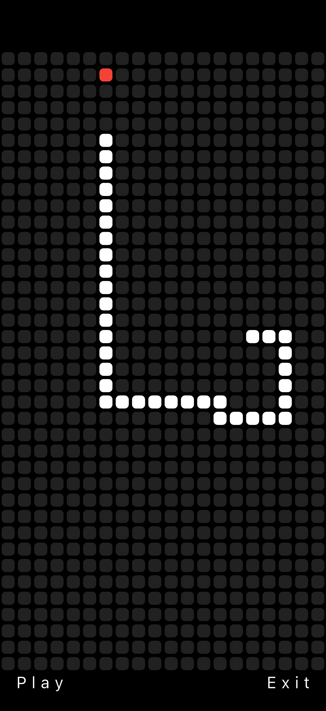
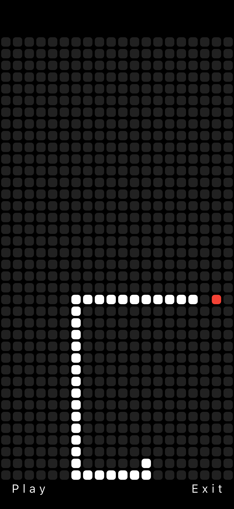
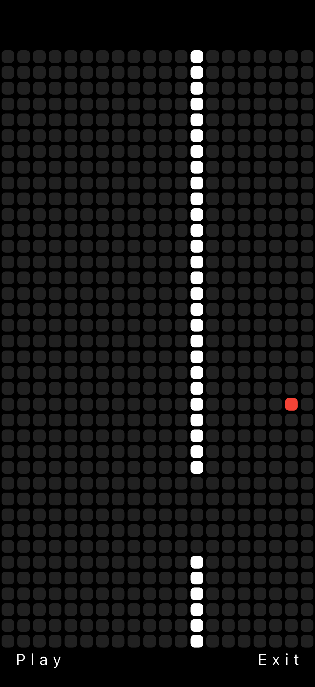
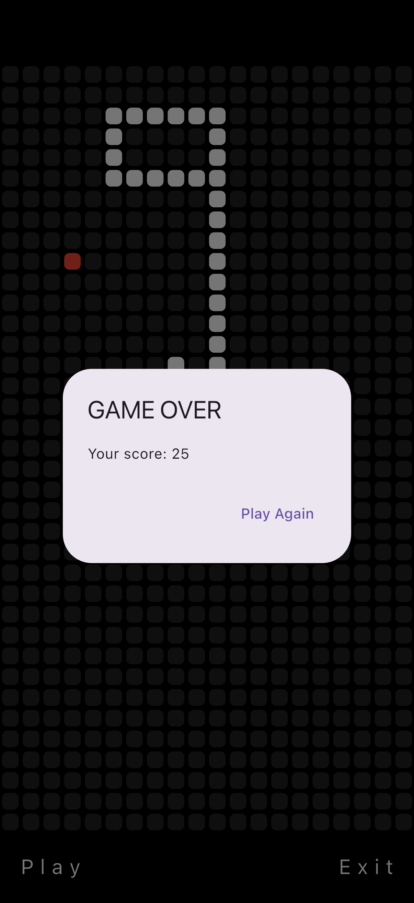

# 🐍 Snake Game – Flutter

A simple and modern **Snake Game built with Flutter**, featuring swipe controls, smooth movement, looping edges (no walls), score tracking, and a clean UI. The game works on **Android** and **iOS**.

## 🚀 Features

* 🟩 Classic snake gameplay with smooth movement
* 🍎 Random food spawning on a 20×38 grid
* 🔄 Looping world (wrap-around edges)
* 🎯 Score system
* 💀 Self-collision game over detection
* 📱 Swipe gesture controls
* ❌ Exit button for native platforms (Android/iOS)

## 📱 App Preview
Here’s how the app looks:

<p align="center">
  
  
  
  
  
  
</p>

## 🧩 How It Works

### 🎮 Game Board

* Grid size: **20 columns × 38 rows** → **760 total tiles**
* Each tile is represented by an index (0–759)

### 🐍 Snake Logic

* Snake is stored as a list of tile indexes
* Moves by adding a head + removing the tail
* When eating food → grows (tail not removed)

### 🍎 Food Generation

* Uses Dart’s `Random()`
* Ensures food never spawns inside the snake body

### 🔁 Game Loop (300ms)

```dart
Timer.periodic(
  const Duration(milliseconds: 300),
  (timer) => updateSnake();
);
```

## 💥 Game Over Rule

Game ends when the snake’s head overlaps with its body.

## ▶️ Run the Game

Make sure Flutter is installed:

```bash
flutter pub get
flutter run
```

## 🛠️ Technologies Used

* Flutter (Dart)
* GestureDetector (swipe control)
* GridView rendering
* Timer periodic loop
* Platform-based exit handling
